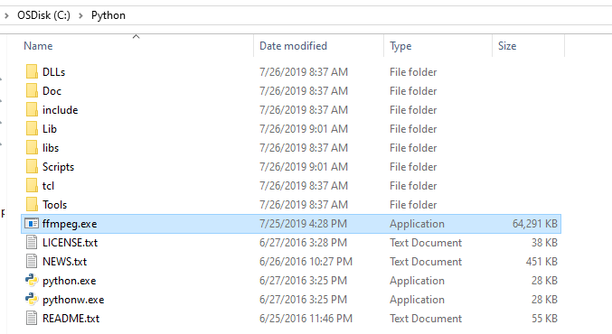
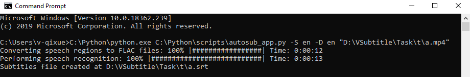
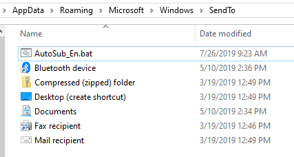
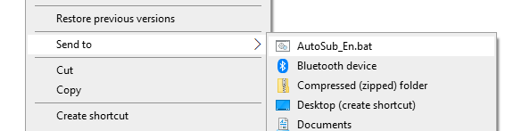
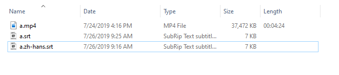

## autosub安装步骤中文版

安装包版本：
- Python 2.7
- autosub-0.3.12

### 安装步骤
1. 下载安装文件。
    ```
    git clone https://github.com/7788wangzi/autosub-zh.git autosub
    ```
1. 切换到安装包文件所在目录**autosub\installer**。
    ```
    cd autosub\installer
    ```
1. 安装Python 2.7：
    - 32位系统安装**python-2.7.12.msi**
    - 64位系统需要安装**python-2.7.12.amd64.msi**
1. 在Select Destination Directory页面，修改安装路径为
    ```
    C:\Python\
    ```
1. 点击Next直到完成所有安装向导，最后点击Finish。
1. 拷贝ffmpeg.exe到目录**C:\Python\**。
    - 解压autosub\installer\ffmpeg.zip
    - 拷贝解压出的ffmpeg.exe到`C:\Python`  
      
1. 通过本地**autosub-0.3.12.tar.gz**方式安装autosub。
    ```
    C:\Python\Scripts\pip.exe install "你的路径\autosub\installer\autosub-0.3.12.tar.gz"
    ```
1. 安装完成后，autosub的安装目录为**C:\Python\Scripts\**。
1. 重命名autosub文件为**autosub_app.py**。
    ```
    rename C:\Python\Scripts\autosub autosub_app.py
    ```
1. 修改autosub_app.py文件，使用VS Code 或Notepad++打开**C:\Python\Scripts\autosub autosub_app.py**
   - Line 48
   ```
   change
   temp = tempfile.NamedTemporaryFile(suffix='.flac')
   to
   temp = tempfile.NamedTemporaryFile(suffix='.flac', delete=False)
   ```
   - Line 127
   ```
   change
   exe_file = os.path.join(path, program)
   to
   exe_file = os.path.join(path, program+".exe")
   ```
1. 重启计算机。

### 使用autosub
1. 打开Command Prompt，找个视频文件尝试生成字幕文件。
    ```
    C:\Python\python.exe C:\Python\scripts\autosub_app.py -S en -D en "你的视频文件*.mp4"
    ```  
    
1. 创建bat文件将autosub放到SendTo菜单中。
1. 切换到SendTo目录"%APPDATA%\Microsoft\Windows\SendTo"
1. 将**AutoSub_En.bat**拷贝到SendTo目录。  
    
    
    验证AutoSub_En.bat加入到SendTo菜单中：
      
1. 最终，在video所在目录生成相应的SRT字幕文件。  
    
